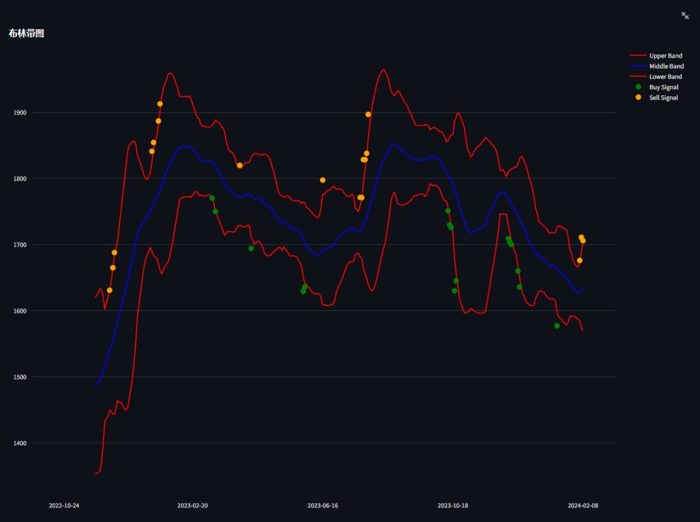

# A股个股数据研究工具 (AStockExplorer)

A股个股数据研究的小工具，该工具结合了[Ashare](https://github.com/mpquant/Ashare/tree/main)开源的代码获取数据。

## 主要特点 (进行中)

- **实时数据获取**：直接从金融API抓取最新的股票数据。
- **技术分析指标**：目前包括K线图、量图和布林带。
- **交互式图表**：利用Plotly生成动态的K线图、交易量图和布林带图。
- **信号标注**：布林带标注潜在的买入和卖出信号。

**这是一个小工具，不作为投资建议**

